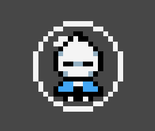

<h1 align="center"> 99 Jam 2D Game Platform </h1>

2D game make in unity for 99 Jam, in 10 days. Check the <a href="https://nymphdev.itch.io/bubbleguy">Itch page</a>

<h1 align="center">Core Game</h1>
<h2>Particles system </h2>

<h2>Inflate bubble Stage 1 and Stage 2</h2>

 
<h2>Using bubble Stage 1</h2>

 
<h2>Using bubble Stage 2</h2>

 
<h2>🚀 Technologies</h2>
<ul>
<li>
Unity 2D Game engine
</li>
<li>
C#
</li>	
<u>
